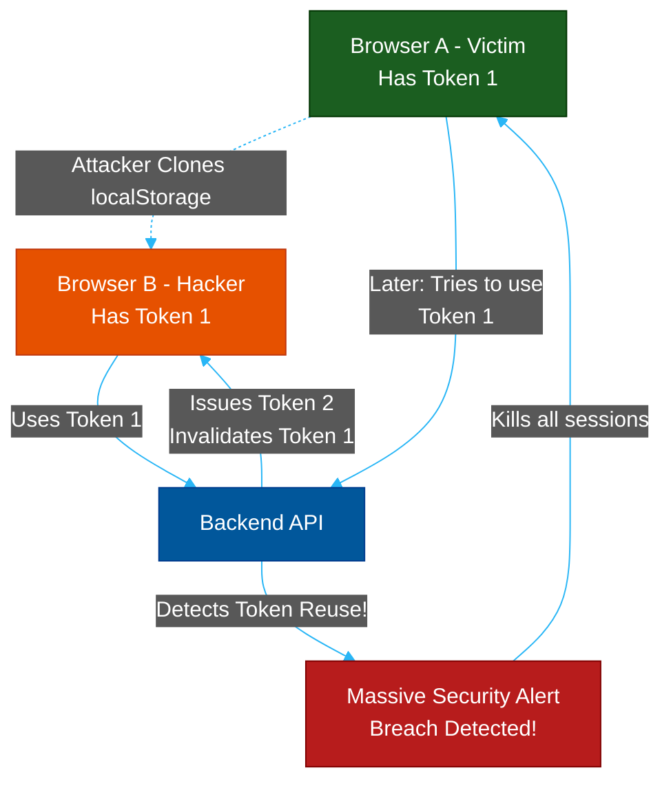

# Advanced Session Cloning & Token Rotation

**Author:** ichamrong  
**Category:** Security & Architecture  
**Read Time:** ~10 min  

---

## 📌 Table of Contents
- [1. The Threat: Total State Cloning](#1-the-threat-total-state-cloning)
- [2. The Google Strategy: State Divergence (Heuristics)](#2-the-google-strategy-state-divergence-heuristics)
- [3. The Telegram Strategy: Refresh Token Rotation](#3-the-telegram-strategy-refresh-token-rotation)
- [📚 References & Tools](#references-tools)

---

## 1. The Threat: Total State Cloning

Standard session defenses (like IP binding or User-Agent checks) are effective against script kiddies, but highly advanced attackers will bypass them using **Total State Cloning**.

Instead of just stealing a cookie, the attacker clones the entire environment:
1. **VM Cloning:** An attacker compromises a developer's machine and clones their entire Android Emulator VM or Docker container.
2. **State Copying:** An attacker copies the entire `localStorage`, `sessionStorage`, and `IndexedDB` payload from a victim's web browser and pastes it into a new browser.

Because the clone is a mathematically perfect 1:1 replica of the original device (same MAC address, same hardware IDs, same tokens), traditional firewalls cannot tell the difference. 

However, massive platforms like Google and Telegram use two distinct architectural strategies to defeat this.

---

## 2. The Google Strategy: State Divergence (Heuristics)

**The Scenario:** You log into Google on an Android Emulator. You clone the emulator VM. For the first few weeks, Google allows *both* emulators to access the account. But suddenly, after a month, the clone is logged out. Why?

**The Architecture:** Google relies on continuous **Heuristic Risk Scoring**.
When the clone is first created, its hardware fingerprint is identical to the original. But over the course of a month, the two environments experience **State Divergence**:
1. **Network Drift:** The original device connects from a home Wi-Fi, while the clone connects from a Datacenter IP or a different cell tower.
2. **Clock Drift:** The internal CPU clocks of the two VMs drift milliseconds apart.
3. **Behavioral Divergence:** The typing speed, mouse movements, and API request frequencies become completely different.

Google's AI risk engine constantly tracks these micro-changes. Once the divergence between the original token and the cloned token reaches a critical threshold, the Risk Engine realizes the device has been cloned. It silently drops the Confidence Score to `0` and revokes the session on the cloned device, forcing a fingerprint re-verification.

---

## 3. The Telegram Strategy: Refresh Token Rotation

**The Scenario:** You copy the `localStorage` data from Telegram Web on Browser A and paste it into Browser B. When you open Browser B, Telegram works perfectly! But the moment you go back to Browser A, you are instantly logged out. Why?

**The Architecture:** Telegram uses strict **Refresh Token Rotation** (The "Highlander" Rule: *There can be only one*).

Telegram does not let you hold a token forever. Every time you use a token, the server replaces it. Here is how it destroys the clone:

1. **The Theft:** Browser B (the clone) steals `Token_v1` from Browser A.
2. **The Rotation:** Browser B opens Telegram and sends `Token_v1` to the API.
3. The server says: *"Valid token! But here is `Token_v2`. Delete `Token_v1`."* Browser B updates its local storage to `Token_v2`.
4. **The Trap is Sprung:** 10 minutes later, the original victim on Browser A opens Telegram. Browser A tries to use `Token_v1`.
5. **The Kill Switch:** The server sees an incoming request for `Token_v1`. But the server knows `Token_v1` was already rotated out! In security architecture, **Token Reuse** is the ultimate red flag—it mathematically proves that the token was stolen and cloned.
6. The server instantly flags the account as compromised and terminates the entire session family, kicking Browser A out to protect the user.

## 📚 References & Tools
- **FingerprintJS** — [fingerprint.com](https://fingerprint.com/)
- **Bypassing MFA via Session Hijacking** — [mitre.org/attack/techniques/T1539/](https://attack.mitre.org/techniques/T1539/)

---

**Navigation:** [Previous: CORS Bypasses](./04-cors-misconfigurations.md) | [Session Security Index](./README.md)

*Last updated: 2026-05-17*

## Related

- [Authentication & Identity Patterns](../auth-and-identity-patterns/README.md)
- [OWASP ASVS 5.0 Verification](../owasp-asvs-5.0/README.md)
- [Bot Protection & CAPTCHAs](../bot-protection/README.md)
