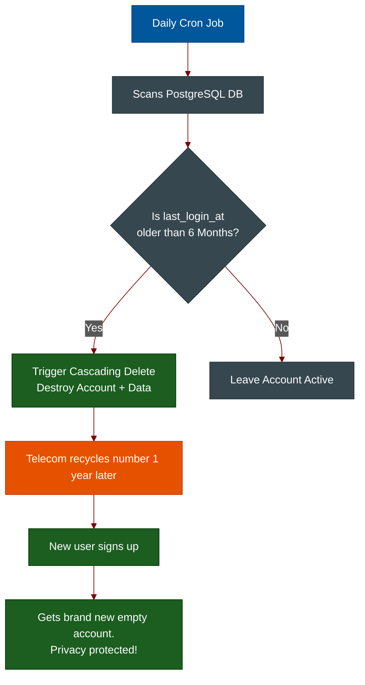

# Inactivity & Telecom Recycling (Self-Destruct)

**Author:** ichamrong  
**Category:** Security & Architecture  
**Read Time:** ~6 min  

---

## 📌 Table of Contents
- [1. The Telegram "Self-Destruct" Feature](#1-the-telegram-self-destruct-feature)
- [2. The Primary Threat: Number Recycling](#2-the-primary-threat-number-recycling)
- [3. The Secondary Threat: Zombie Botnets](#3-the-secondary-threat-zombie-botnets)
- [📚 References & Tools](#references-tools)

---

## 1. The Telegram "Self-Destruct" Feature

If you look at Telegram's privacy settings, there is a default feature configured for all users: **"If away for 6 months, delete my account."**

Many users assume this is just to save server space or for general privacy. While Data Minimization (GDPR compliance) is a benefit, the true architectural reason for this feature is to prevent one of the most dangerous, unpatchable vulnerabilities in cybersecurity: **Telecom Phone Number Recycling**.

---

## 2. The Primary Threat: Number Recycling

If your application uses SMS OTP or Phone Numbers as the primary identifier for an account, you are at the mercy of the global Telecom industry.

**The Attack Vector:**
1. A user creates a Telegram account using their phone number: `+1-555-0199`.
2. The user stops using the app and throws away their SIM card, but forgets to manually click "Delete Account".
3. **90 Days Later:** The telecom provider (e.g., AT&T, Vodafone) officially recycles the phone number and issues `+1-555-0199` to a completely new customer.
4. The new customer downloads Telegram and types in their new phone number.
5. Telegram sends the SMS OTP. The new customer enters it.
6. **The Breach:** Because the original account was never deleted, the new customer is instantly dropped into the original user's account. They have full access to all historical group chats, private messages, and contacts.

**The Architectural Defense:**
Telegram cannot control when a telecom provider recycles a number. The *only* way to defend against this is an **Inactivity TTL (Time-To-Live)**. By enforcing a strict rule that destroys an account if it hasn't connected to the server in 6 months, Telegram mathematically ensures that by the time a telecom company recycles the number to a new human, the old account is already gone.

---

## 3. The Secondary Threat: Zombie Botnets

Beyond the telecom issue, enforcing an inactivity timeout is a critical defense mechanism against **Bot Farms**. 

As we discussed in the *Anti-Spam Architecture* library, "Account Age" heavily influences a user's Trust Score. Because of this, massive bot developers don't launch attacks immediately. 

**The Zombie Attack:**
1. The bot developer creates 10,000 fake accounts.
2. They do nothing with them. They let them sleep for 2 years.
3. Two years later, the accounts have a massive "Age" Trust Score.
4. The attacker wakes them all up at once to launch a devastating spam campaign that bypasses standard rate limits.

**The Architectural Defense:**
By running a daily backend Cron Job that sweeps the database for users where `last_login_at < NOW() - INTERVAL 6 MONTHS`, the system automatically purges "Zombie Accounts." It forces bot developers to constantly spend money keeping the accounts "alive," which ruins their profit margins.

## 📚 References & Tools
- **NIST SP 800-63B (Identity Guidelines)** — [pages.nist.gov/800-63-3/sp800-63b.html](https://pages.nist.gov/800-63-3/sp800-63b.html)
- **Telecom Recycling Risks (FCC)** — [fcc.gov/consumers/guides/reassigned-numbers-database](https://www.fcc.gov/consumers/guides/reassigned-numbers-database)

---

**Navigation:** [Previous: Session Cloning](./05-advanced-session-cloning.md) | [Session Security Index](./README.md)

*Last updated: 2026-05-17*

## Related

- [Authentication & Identity Patterns](../auth-and-identity-patterns/README.md)
- [OWASP ASVS 5.0 Verification](../owasp-asvs-5.0/README.md)
- [Bot Protection & CAPTCHAs](../bot-protection/README.md)
