# Digital Deception: Phishing Variants

**Author:** ichamrong  
**Category:** Security & Architecture  
**Read Time:** ~10 min  

---

## 📌 Table of Contents
- [1. Phishing (Spray and Pray)](#1-phishing-spray-and-pray)
- [2. Spear Phishing (The Sniper Rifle)](#2-spear-phishing-the-sniper-rifle)
- [3. Whaling (The CEO Fraud)](#3-whaling-the-ceo-fraud)
- [4. Vishing (Voice Phishing)](#4-vishing-voice-phishing)
  - [Case Study #1: The 2020 Twitter Master-Hack](#case-study-1-the-2020-twitter-master-hack)
  - [Case Study #2: The Booking.com Partner Scam (Session Hijacking)](#case-study-2-the-bookingcom-partner-scam-session-hijacking)
- [5. Smishing (SMS Phishing)](#5-smishing-sms-phishing)
- [📚 References & Tools](#references-tools)

---

Digital Deception relies on electronic communication channels to trick victims. It is the most common and scalable form of social engineering.

## 1. Phishing (Spray and Pray)
**What it is:** The attacker sends out 100,000 generic emails hoping that 1% of the targets will fall for it. 
**Example:** An email claiming to be from "Netflix Support" stating: *"Your billing failed. Click here to update your credit card."* The link goes to a fake login page.
**The Goal:** Harvesting basic consumer credentials and credit cards.

## 2. Spear Phishing (The Sniper Rifle)
**What it is:** Unlike generic phishing, Spear Phishing is highly targeted. The attacker spends days researching a specific employee using LinkedIn (OSINT).
**Example:** An email sent to a Junior DevOps Engineer: *"Hey Sarah, I'm the new VP of Engineering, John. I can't access the AWS production cluster. Can you send me the temporary SSH keys? Attached is my onboarding ticket."* The email appears to come from an internal domain.
**The Goal:** Breaching specific corporate networks.

## 3. Whaling (The CEO Fraud)
**What it is:** A subset of Spear Phishing where the target is a "Whale"—a high-level executive like the CEO or Chief Financial Officer (CFO). This is often called **Business Email Compromise (BEC)**.
**Example:** The attacker compromises the CEO's actual email account. They email the CFO on a Friday at 4:45 PM: *"I am in a confidential meeting with a Chinese supplier. I need you to wire $2.5 Million to this offshore account immediately to secure the acquisition. Do not tell anyone."*
**The Goal:** Massive financial theft.

## 4. Vishing (Voice Phishing)
**What it is:** Phishing over the telephone. Attackers often spoof caller ID so it looks like an internal company number.
**The Rise of Deepfakes:** In recent years, attackers have used AI voice-cloning. They take 3 minutes of a CEO speaking on YouTube, clone their voice perfectly, and call an employee to demand a money transfer. 

### Case Study #1: The 2020 Twitter Master-Hack
- **The Attack:** In July 2020, a group of teenagers executed one of the greatest hacks in history. They did not exploit a zero-day in Twitter's code. They used **Vishing**.
- **The Execution:** They called Twitter's remote IT workers, pretending to be the Twitter Help Desk. They claimed there was a VPN issue and directed the employees to a fake VPN login page.
- **The Result:** The employees typed in their credentials and Multi-Factor Authentication (MFA) tokens. The teenagers instantly used those tokens to log into Twitter's internal "God Mode" admin panel. They hijacked the accounts of Barack Obama, Elon Musk, and Bill Gates, tweeting out a massive Bitcoin scam.

```mermaid
%%{init: {'theme': 'dark', 'themeVariables': {'primaryColor': '#4a148c', 'primaryTextColor': '#ffffff', 'lineColor': '#6a1b9a',
    'background': '#1e1e1e'},
  'themeCSS': 'svg { background-color: #1e1e1e !important; padding: 1rem !important; border-radius: 8px !important; } .edgeLabel rect { fill: #1e1e1e !important; } text, tspan, .messageText, .signalText, .edgeLabel, .edgeLabel span, .pointLabel, .axisLabel, .quadrantTitle, .quadrantLabel { fill: #ffffff !important; color: #ffffff !important; stroke: none !important; }'
}}%%
flowchart LR
    classDef hacker fill:#e65100,stroke:#bf360c,color:#fff
    classDef human fill:#01579b,stroke:#003c8f,color:#fff
    classDef risk fill:#b71c1c,stroke:#7f0000,color:#fff
    
    A[Hacker spoofing<br/>IT Phone Number]:::hacker -->|Calls Victim| B[Twitter Remote<br/>Employee]:::human
    B -->|Believes the story| C[Types MFA code into<br/>fake VPN portal]:::risk
    C -->|Relays MFA| D[Hacker logs into<br/>Real Admin Panel]:::hacker
```

**The Lesson & Prevention:**
1. **Hardware Security Keys (FIDO2 / YubiKey):** SMS codes and Authenticator Apps (TOTP) can be easily phished. Physical hardware keys cannot. A YubiKey cryptographically verifies the domain name. If the employee was on `fake-vpn-twitter.com`, the YubiKey would have mathematically refused to authenticate the login.
2. **Principle of Least Privilege:** A remote IT support worker should never have "God Mode" access to hijack a verified user's account. Highly destructive actions should require **Multi-Party Authorization** (e.g., two Senior Engineers must approve the action).

### Case Study #2: The Booking.com Partner Scam (Session Hijacking)
- **The Attack:** Attackers realized that hacking Booking.com's massive servers was impossible. Instead, they targeted the weak link: the thousands of small, family-owned hotels that use the platform.
- **The Execution:** The attacker emails a hotel claiming to be a former guest: *"I think I left my passport in room 204. I attached a photo of it, please check!"* The attached "photo" is actually a `.exe` malware or a malicious PDF link. 
- **The Breach:** The hotel receptionist opens the file. The malware silently steals the `session cookie` for the hotel's Booking.com Admin Dashboard and sends it to the attacker.
- **The Exploit:** The attacker uses the stolen cookie to bypass MFA and log into the hotel's dashboard. The attacker then uses the *official* Booking.com messaging system to message all upcoming guests: *"Your credit card was declined. Please pay via this link immediately or your reservation will be canceled."*
- **The Result:** Guests trust the message because it comes directly from the official Booking.com app. They pay the attacker, arriving at the hotel only to realize they were scammed.

**The Lesson & Prevention:**
1. **Session Binding:** Backend architectures must bind the session cookie to the IP Address or Browser Fingerprint. If a session cookie is generated in Paris (the hotel) and suddenly used in Russia 5 seconds later, the backend API should instantly invalidate the token and force a re-login.
2. **Zero Trust File Parsing:** Never allow hotel partners to download raw attachments from guest messages. The platform should intercept all images, render them server-side, and display them securely in the browser to prevent malware execution.

## 5. Smishing (SMS Phishing)
**What it is:** Phishing via Text Message. 
**Example:** *"UPS: Your package could not be delivered due to an unpaid customs fee of $1.50. Click here to pay: http://ups-delivery-track.com"*
**Why it works:** People are inherently more trusting of SMS messages than emails, and it is harder to inspect a URL on a small mobile screen.

## 📚 References & Tools
- **CISA Phishing Guidance** — [cisa.gov/stopransomware/phishing-guidance](https://www.cisa.gov/stopransomware/phishing-guidance)
- **NIST Phishing Training** — [csrc.nist.gov/publications/detail/sp/800-50/rev-1/final](https://csrc.nist.gov/publications/detail/sp/800-50/rev-1/final)

---

**Navigation:** [Next: Physical Intrusions](./02-physical-and-in-person-attacks.md) | [Social Engineering Index](./README.md)

*Last updated: 2026-05-17*

## Related

- [Network Security & Logs](../network-security/README.md)
- [Authentication & Identity Patterns](../auth-and-identity-patterns/README.md)
- [Bot Protection & CAPTCHAs](../bot-protection/README.md)
