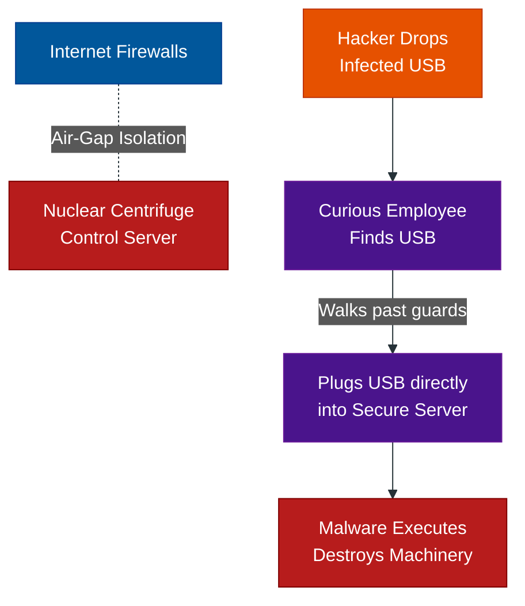

# Physical Intrusions & Real-World Attacks

**Author:** ichamrong  
**Category:** Security & Architecture  
**Read Time:** ~8 min  

---

## 📌 Table of Contents
- [1. Tailgating (Piggybacking)](#1-tailgating-piggybacking)
- [2. The USB Drop (Physical Baiting)](#2-the-usb-drop-physical-baiting)
  - [Case Study #2: Stuxnet (The Air-Gapped Breach)](#case-study-2-stuxnet-the-air-gapped-breach)
- [3. Shoulder Surfing](#3-shoulder-surfing)
- [4. Dumpster Diving](#4-dumpster-diving)
- [📚 References & Tools](#references-tools)

---

A devastating cyberattack does not always happen from a basement in Russia. Sometimes, the attacker is standing in your office lobby holding a cup of coffee. Physical social engineering exploits human politeness and physical proximity.

## 1. Tailgating (Piggybacking)
**What it is:** An attacker follows directly behind an authorized employee into a restricted area without swiping their own RFID badge.
**The Execution:** The attacker dresses like an employee (business casual), holds two large boxes of donuts, and waits by the secure door. When a real employee swipes their badge to open the door, the attacker says, *"Hey, could you hold the door for me? My hands are full!"* 
**The Psychology:** Human beings are inherently polite. Slamming a door in someone's face feels unnatural. The attacker exploits this politeness to bypass multi-million dollar biometric security systems.

## 2. The USB Drop (Physical Baiting)
**What it is:** Leaving a malware-infected physical device in a location where an employee is guaranteed to find it.
**The Execution:** The attacker buys a cheap USB drive, infects it with a Keylogger, and writes "Q3 Executive Salary Adjustments" on it with a Sharpie. They drop it in the company parking lot or the cafeteria.
**The Psychology:** Human curiosity is overwhelming. The employee picks it up and plugs it into their secure corporate laptop just to "see what it is." The malware instantly executes, bypassing the external firewall completely because the attack originated from *inside* the network.

### Case Study #2: Stuxnet (The Air-Gapped Breach)
- **The Target:** The Iranian Natanz nuclear enrichment facility. The computers running the nuclear centrifuges were "air-gapped" (physically disconnected from the internet). It was theoretically impossible to hack them remotely.
- **The Execution:** US/Israeli intelligence allegedly used a **USB Drop**. They infected USB drives with the Stuxnet worm and dropped them in the parking lots and near the homes of the nuclear facility's contractors.
- **The Result:** A contractor picked up a USB drive, walked past the physical guards, sat at their air-gapped terminal, and plugged it in. The worm executed, crossed the air-gap, and physically spun the nuclear centrifuges out of control until they destroyed themselves.

## 3. Shoulder Surfing
**What it is:** The attacker physically looks over the victim's shoulder to steal information.
**The Execution:** Standing behind a target at an airport coffee shop and watching their fingers as they type their laptop password, or using a telephoto lens from a building across the street to read confidential documents sitting on a CEO's desk.

## 4. Dumpster Diving
**What it is:** Digging through the physical trash of a corporation.
**The Execution:** Companies often throw away sticky notes with passwords, old employee directories, server IP addresses, or un-shredded proprietary documents. An attacker uses this highly specific intel to craft a flawless Spear Phishing campaign.

## 📚 References & Tools
- **Physical Security & Tailgating Defenses** — [cisa.gov/physical-security](https://www.cisa.gov/topics/physical-security)
- **Clean Desk & Clear Screen Policies** — [sans.org/security-awareness-training/resources/clean-desk-policy/](https://www.sans.org/security-awareness-training/resources/clean-desk-policy/)

---

**Navigation:** [Previous: Digital Deception](./01-phishing-and-digital-deception.md) | [Next: Psychological Manipulation](./03-psychological-manipulation-and-pretexting.md) | [Social Engineering Index](./README.md)

*Last updated: 2026-05-17*

## Related

- [Network Security & Logs](../network-security/README.md)
- [Authentication & Identity Patterns](../auth-and-identity-patterns/README.md)
- [Bot Protection & CAPTCHAs](../bot-protection/README.md)
