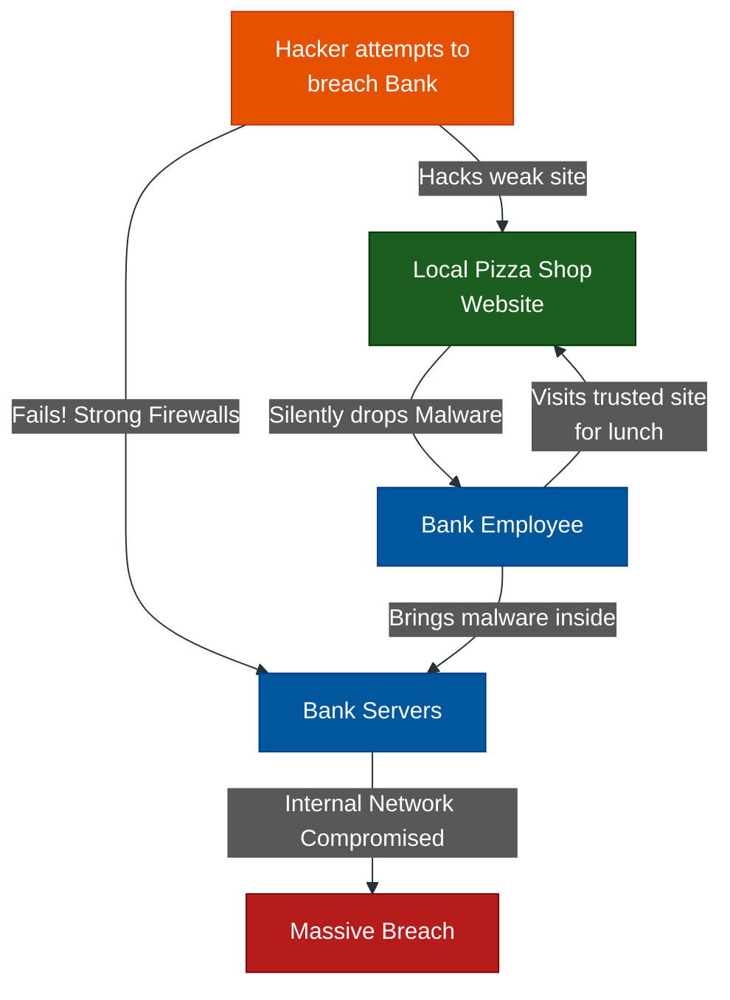

# Psychological Manipulation & Pretexting

**Author:** ichamrong  
**Category:** Security & Architecture  
**Read Time:** ~10 min  

---

## 📌 Table of Contents
- [1. Pretexting (The Fabricated Scenario)](#1-pretexting-the-fabricated-scenario)
- [2. Quid Pro Quo (Something for Something)](#2-quid-pro-quo-something-for-something)
- [3. The Water Holing Attack (The Supply Chain)](#3-the-water-holing-attack-the-supply-chain)
- [4. Urgency & Fear Tactics](#4-urgency-fear-tactics)
- [📚 References & Tools](#references-tools)

---

Underneath every Social Engineering attack is a core psychological manipulation tactic. Attackers use specific cognitive biases to force the victim to act quickly and irrationally.

## 1. Pretexting (The Fabricated Scenario)
**What it is:** Pretexting is the foundation of social engineering. It involves the attacker creating a heavily detailed, fabricated scenario (the pretext) to justify why they need the victim's information.
**The Execution:** The attacker doesn't just say, *"Give me your password."* They say, *"Hi, I am David from Corporate IT. We are currently experiencing a massive data breach on the mail server. I am trying to quarantine your account before your data is stolen. I need your password to freeze the account immediately."*
**The Psychology:** The attacker positions themselves as an authority figure (IT Support, Police, IRS) trying to *help* the victim.

## 2. Quid Pro Quo (Something for Something)
**What it is:** The attacker offers a benefit or service in exchange for information.
**The Execution:** An attacker calls an office pretending to be conducting a "Cybersecurity Awareness Survey" and offers a $50 Amazon Gift Card to anyone who participates. The final question of the survey is, *"And what is your current network password, just so we can verify its strength?"*
**The Psychology:** Greed. People will gladly bypass security protocols if they believe they are getting something valuable for free.

## 3. The Water Holing Attack (The Supply Chain)
**What it is:** If an attacker wants to hack a heavily fortified target (like the Department of Defense), they know they cannot breach the front door. Instead, they find out what websites the employees visit frequently, and infect *that* website.
**The Execution:** The attacker discovers that the employees of a major bank always order lunch on Fridays from a specific local pizza shop's website. The attacker hacks the pizza shop's poorly secured WordPress site and injects a Zero-Day malware exploit into the menu page. When the bankers visit the site on Friday, their corporate laptops are infected.
**The Psychology:** Exploiting the "Zone of Trust." The employees let their guard down because they trust the local pizza shop.

## 4. Urgency & Fear Tactics
**What it is:** Attackers know that if a victim stops to think logically for 30 seconds, the attack will fail. Therefore, they must induce panic.
**The Execution:** *"Your account will be permanently deleted in 15 minutes."* or *"The CEO is furious, he needs this wire transfer done right now."* 
**The Psychology:** The Amygdala Hijack. When humans are stressed or panicked, the logical part of the brain shuts down, and the fight-or-flight response takes over. The victim acts impulsively to relieve the stress, handing over the keys to the kingdom.

## 📚 References & Tools
- **Social Engineering Incident Response** — [cisa.gov/news-events/cybersecurity-advisories/aa22-137a](https://www.cisa.gov/news-events/cybersecurity-advisories/aa22-137a)
- **Defending Against Pretexting** — [ftc.gov/business-guidance/resources/social-engineering-attacks](https://www.ftc.gov/business-guidance/resources/social-engineering-attacks)

---

**Navigation:** [Previous: Physical Intrusions](./02-physical-and-in-person-attacks.md) | [Social Engineering Index](./README.md)

*Last updated: 2026-05-17*

## Related

- [Network Security & Logs](../network-security/README.md)
- [Authentication & Identity Patterns](../auth-and-identity-patterns/README.md)
- [Bot Protection & CAPTCHAs](../bot-protection/README.md)
