# Social Engineering: The Human Vulnerability

**Author:** ichamrong  
**Category:** Security & Architecture  
**Read Time:** ~3 min  

---

## 1. Hacking the Human

In cybersecurity, companies spend millions of dollars on Web Application Firewalls (WAFs), Zero Trust networks, and encryption. However, the weakest link in any system is never the code; **it is the human being**.

**Social Engineering** is the psychological manipulation of people into performing actions or divulging confidential information. It relies on fundamental human traits: Trust, Fear, Greed, and the desire to be helpful.

There is no software patch for human psychology.

## 2. The Social Engineering Matrix

The attacks are broken down into three core groups based on their vector of approach:

| Category | Core Concept | Document |
| :--- | :--- | :--- |
| **1. Digital Deception** | Phishing, Spear Phishing, Whaling, Vishing, Smishing. | [View Guide](./01-phishing-and-digital-deception.md) |
| **2. Physical Intrusions** | Tailgating, USB Drops, Dumpster Diving, Shoulder Surfing. | [View Guide](./02-physical-and-in-person-attacks.md) |
| **3. Psychological Tactics** | Pretexting, Quid Pro Quo, Water Holing, Urgency Triggers. | [View Guide](./03-psychological-manipulation-and-pretexting.md) |

---

## 3. The Anatomy of an Attack

Almost every social engineering attack follows the exact same 4-phase lifecycle:

```mermaid
%%{init: {'theme': 'dark', 'themeVariables': {'primaryColor': '#37474f', 'primaryTextColor': '#ffffff', 'lineColor': '#263238',
    'background': '#1e1e1e'},
  'themeCSS': 'svg { background-color: #1e1e1e !important; padding: 1rem !important; border-radius: 8px !important; } .edgeLabel rect { fill: #1e1e1e !important; } text, tspan, .messageText, .signalText, .edgeLabel, .edgeLabel span, .pointLabel, .axisLabel, .quadrantTitle, .quadrantLabel { fill: #ffffff !important; color: #ffffff !important; stroke: none !important; }'
}}%%
flowchart LR
    classDef intel fill:#01579b,stroke:#003c8f,color:#fff
    classDef hook fill:#e65100,stroke:#bf360c,color:#fff
    classDef play fill:#b71c1c,stroke:#7f0000,color:#fff
    classDef exit fill:#1b5e20,stroke:#003300,color:#fff
    
    A[1. Intelligence<br/>Gathering]:::intel -->|OSINT / LinkedIn| B[2. The Hook<br/>Pretexting]:::hook
    B -->|Establishes Trust| C[3. The Play<br/>Execution]:::play
    C -->|Extracts Data| D[4. The Exit<br/>Covering Tracks]:::exit
```

1. **Intelligence Gathering:** The attacker uses LinkedIn to find the victim's name, their manager's name, and what software the company uses.
2. **The Hook:** The attacker initiates contact (Email, Phone) using a fabricated story (Pretexting) to build trust or induce panic.
3. **The Play:** The attacker asks for the password, the wire transfer, or access to the building.
4. **The Exit:** The attacker achieves the goal and exits gracefully without raising alarms until it is too late.

---

*Last updated: 2026-05-17*
